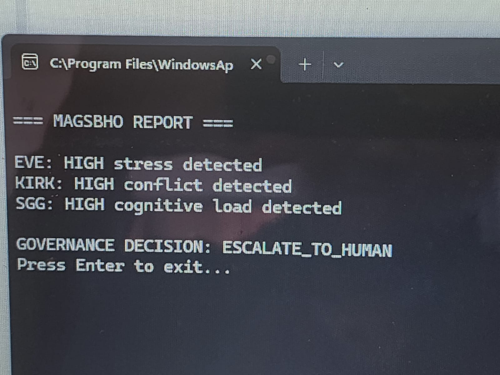

# MAGSBHO Prototype

## Governance-Constrained Multi-Agent AI Safety Prototype

This repository contains a simple Python prototype inspired by the **MAGSBHO (Multi-Agent Governance System for Behavioral Health)** framework.

### Purpose
The goal of this prototype is to demonstrate a small, interpretable part of a governance-constrained multi-agent system for high-risk environments.

### What the prototype includes
- **EVE**: wellness support agent for stress and emotional regulation
- **KIRK**: ethical / cohesion agent for conflict and team stability
- **SGG**: cognitive support agent for task load and confusion
- **Governance Layer**: combines agent outputs and determines bounded action

### Core safety concept
This prototype is designed around a simple AI safety principle:

**No single agent acts autonomously in a high-risk situation.**  
Instead, a governance layer evaluates the combined outputs and decides whether to:
- provide routine support
- support and monitor
- escalate to a human

## EarthStar "Do No Harm" Protocol

This prototype is informed by the **EarthStar "Do No Harm" protocol**, a governance-first safety principle designed to reduce the risk of harmful, overreaching, or unsafe autonomous behavior in high-risk environments.

In this prototype, the EarthStar principle is reflected through:

- **bounded autonomy**: no single agent acts independently in a high-risk situation  
- **human-in-the-loop escalation**: elevated-risk cases are routed to a human rather than handled autonomously  
- **conservative safety logic**: when multiple agents detect risk, the system favors escalation over autonomous action  
- **role-bounded agents**: each agent operates within a limited scope rather than making unrestricted decisions  

The EarthStar protocol in this prototype represents an early computational expression of a broader safety and governance philosophy for human-centered AI systems operating in isolated, confined, and extreme environments.

---

## MMAARS★ Non-Tokenized Data Training Protocol

This prototype is also informed by the **MMAARS★ non-tokenized data training protocol**, a data governance approach designed to preserve human context, meaning, and ethical integrity in AI-supported systems.

Unlike traditional token-based processing approaches, the MMAARS★ framework emphasizes:

- **context-preserving inputs**: maintaining full situational meaning rather than reducing interactions to isolated data points  
- **human-centered interpretation**: prioritizing lived experience, behavioral context, and mission conditions  
- **non-extractive data handling**: avoiding decontextualized or purely statistical representations of human behavior  
- **ethical data boundaries**: ensuring that sensitive human states (e.g., stress, conflict, emotional signals) are interpreted within safe and bounded frameworks  

In this prototype, the MMAARS★ philosophy is reflected in the structured scenario inputs (e.g., stress, conflict, cognitive load, repeated patterns), which are treated as **contextual signals rather than abstracted inputs**.

Together with the EarthStar protocol, this approach reinforces a system design that prioritizes **safety, interpretability, and preservation of human meaning** in high-risk operational environments. 
This integration of governance (MAGSBHO), safety constraints (EarthStar), and contextual data interpretation (MMAARS★) reflects a unified approach to human-centered AI system design.

### Example output
The current demo mission case simulates:
- elevated stress
- team conflict
- cognitive overload
- repeated issue pattern
### Example Run Output

Below is a sample output from running the prototype:



This leads to a governance decision of:

`ESCALATE_TO_HUMAN`

### Run the code
```bash
py magsbho_prototype.py
